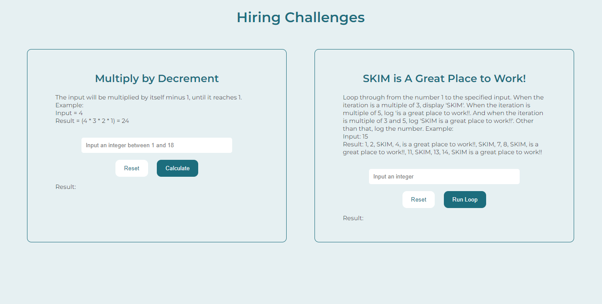

# Hiring Challenges
This web page was created as a solution to hiring challenges, which was one of the recruitment steps at SKIM. View the live web page [here](https://dissyulina.github.io/skim-challenges/).  

   

## Technology Used
### Main Languages
- HTML   
- CSS   
- JavaScript   

### Frameworks & Libraries
- [Google Fonts](https://fonts.google.com/)   
Google fonts was used to import the "Montserrat" fonts into the html file.  

   

## Design and Features

- Color scheme was adopted from [SKIM website](https://skimgroup.com/).  
- The web page is fully responsive on all device sizes. On desktop, the challenges are positioned next to each other, while on mobile and tablets, the challenges are stacked vertically.   
- Input box is displayed with a placeholder to inform the user what input it expects. When the user inputs the wrong number, an error message appears to advise the user to input the correct one.  
- Besides calculate/ run button, a reset button is also added in order to reset the input and result back to the beginning. The colors change subtly when the mouse hovers above both buttons.  
- Both challenges are horizontally and vertically centered on the desktop.  

   

## Testing and Validation
The final version passed the following validator/ tester:
- [W3C Markup Validator](https://validator.w3.org/) - for HTML  
- [W3C CSS Validator](https://jigsaw.w3.org/css-validator/) - for CSS  
- [JSHint](https://jshint.com/) - for JavaScript   

